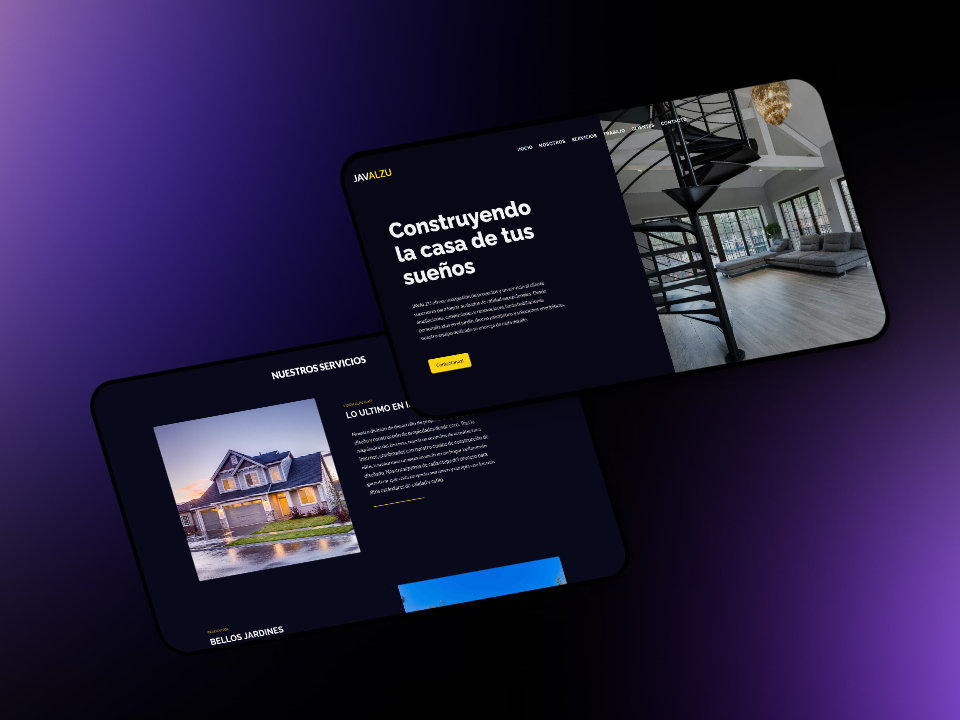

  

<h1 align="center"> Web de construccion de hogares </h1>

 Una web enfocado a una empresa de diseño de hogares nuevos sustentables.   Un diseño simple pero elegante

## Flujo de Desarrollo

1. **Mobile First:** Diseñado con un enfoque en dispositivos móviles primero.

 ## Tecnologías Utilizadas
- HTML5
- SCSS
- JavaScript
- ScrollReveal.js

## clone
1. git clone https://github.com/jaalzu/pagina-arquitectura.git
2. cd pagina-arquitectura
3. npm install
4. npm run build-css
5. npm start

  

Contacto: javalzu@gmail.com

